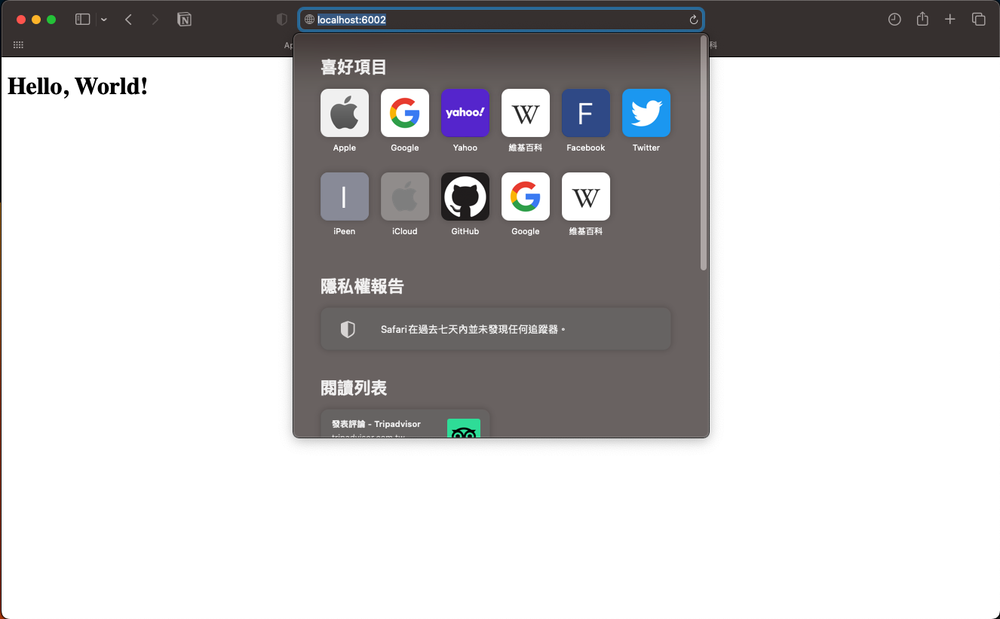

### run the program
```shell
./server $port
```
* use the http parser from [picohttpparser](https://github.com/h2o/picohttpparser/)
* only return `Hello World`

### example


```shell
./server 60002
```

### result


